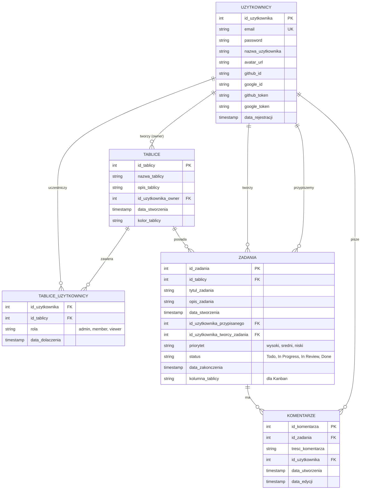

# project-integration-of-it-systems

tasks na najblizsze 3 dni:  
Malwina -> CI/CD testy automatyczne po pushu  (.yml)  
Olanki - Drugi projekt w tym samym repo do testow  
OliwiaS - Architektura (foldery drzewko komponenty)  

## Diagram ERD bazy danych:
  

