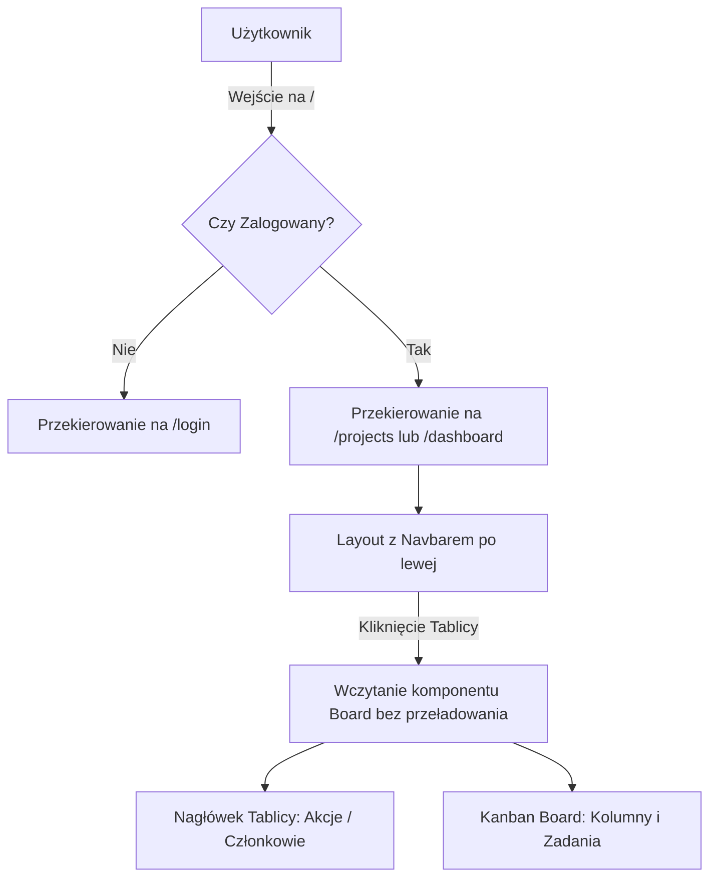

# Plan Implementacji - Blazor Boards Dashboard

Ten plan opisuje architekturę i kroki wdrożenia panelu tablic Kanban (Jira-like) w technologii ASP.NET Core Blazor.

---

## 🏗️ Architektura i Przepływ Danych



---

## 📌 Milestones (Kamienie Milowe)

### Milestone 1: Zabezpieczenie Routingu & Autoryzacja
Upewnienie się, że niezalogowani użytkownicy są automatycznie przekierowywani na `/login`.

1. **Konfiguracja Blazor AuthorizeRouteView**:
   W pliku `App.razor` (lub głównym pliku routingu) opakuj router w `<AuthorizeRouteView>` z fallbackiem przekierowującym na `/login` w przypadku braku autoryzacji:
   ```razor
   <AuthorizeRouteView RouteData="context" DefaultLayout="typeof(MainLayout)">
       <NotAuthorized>
           <RedirectToLogin />
       </NotAuthorized>
   </AuthorizeRouteView>
   ```
2. **Dodanie komponentu pomocniczego `RedirectToLogin.razor`**:
   Komponent, który przy zainicjalizowaniu wykonuje `NavigationManager.NavigateTo("/login", forceLoad: true)`.
3. **Zabezpieczenie stron**:
   Dodaj `@attribute [Authorize]` na początku stron wymagających zalogowania (np. `/projects`, `/dashboard`).

---

### Milestone 2: Główny Layout & Dynamiczne Wczytywanie Tablic
Zbudowanie dwukolumnowego układu (Navbar po lewej, treść po prawej) z obsługą wyboru aktywnej tablicy.

1. **Lewy Navbar**:
   * Pobranie listy tablic powiązanych z zalogowanym użytkownikiem (właściciel lub członek tablicy z tabeli `TABLICE_UZYTKOWNICY`).
   * Pętla generująca listę linków z dynamiczną klasą CSS (np. `active` dla wybranej tablicy).
2. **Brak przeładowania strony**:
   * Użyj komponentu nadrzędnego (np. `/dashboard`), który przechowuje stan `SelectedBoardId`.
   * Po kliknięciu na tablicę w navbarze, zamiast przechodzić na inną stronę, wywoływane jest zdarzenie zmieniające `SelectedBoardId`.
   * Prawa strona renderuje warunkowo:
     ```razor
     @if (selectedBoard != null) {
         <BoardView Board="selectedBoard" />
     }
     ```

---

### Milestone 3: Nagłówek Tablicy & Członkowie (Contributors)
Dodanie paska narzędziowego nad wybraną tablicą.

1. **Contributors List**:
   * Pobranie listy członków danej tablicy z bazy.
   * Renderowanie avatarów (wyświetl max 5 za pomocą pętli `@foreach (var user in members.Take(5))`, a dla reszty dodaj element `+X` lub trzy kropki `...` pokazujące tooltip/modal z całą listą).
2. **Dodawanie członka tablicy (Full-Text Search)**:
   * Przycisk otwierający dropdown lub popover z wyszukiwarką.
   * Wyszukiwanie użytkowników w bazie po imieniu/nazwisku/emailu za pomocą ILIKE lub FTS w PostgreSQL.
   * Po wybraniu użytkownika: dodanie rekordu do tabeli `TABLICE_UZYTKOWNICY` z rolą `member`.

---

### Milestone 4: Wyszukiwanie Zadań & Dodawanie Zadań
Implementacja wyszukiwania i operacji na zadaniach w obrębie wybranej tablicy.

1. **Wyszukiwarka Zadań (FTS)**:
   * Przycisk/input filtrujący zadania w locie na aktywnej tablicy.
   * Zapytanie LINQ do bazy PostgreSQL wykorzystujące FTS (np. `EF.Functions.ToTsVector` lub prostsze `EF.Functions.ILike`) do przeszukiwania pól `tytul_zadania` oraz `opis_zadania`.
2. **Przycisk Dodaj Zadanie**:
   * Otwiera modal z formularzem (tytuł, opis, priorytet, przypisany użytkownik).
   * Zapis do bazy i automatyczne odświeżenie widoku tablicy w Blazor Server.

---

### Milestone 5: API Generatora Avatarów & Base64
Zarządzanie grafikami użytkowników.

1. **Generowanie awatarów (Fallback)**:
   * Jeśli użytkownik nie ma ustawionego `AvatarUrl` z Google/GitHub, generuj awatar na podstawie jego inicjałów (np. za pomocą darmowych API jak `https://ui-avatars.com/api/?name=Jan+Kowalski`).
2. **Zapis i odczyt Base64**:
   * Jeśli użytkownik wgrywa własny awatar, przekonwertuj plik na ciąg Base64 i zapisz w bazie.
   * W kodzie HTML renderuj go jako: ``.

---

## 🔍 O czym mogłaś zapomnieć?

1. **Obsługa Ról (Uprawnienia członków)**:
   Czy każdy dodany członek zespołu może dodawać zadania i usuwać innych członków? Warto uwzględnić kolumnę `rola` w `TABLICE_UZYTKOWNICY` (np. Owner, Admin, Member) i blokować niektóre przyciski na froncie na podstawie roli zalogowanego użytkownika na danej tablicy.
2. **Nawigacja bezpośrednia (Deep Linking)**:
   Jeśli użytkownik odświeży stronę, będąc na konkretnej tablicy, stan `SelectedBoardId` w pamięci zostanie utracony i wróci do domyślnej tablicy. Warto rozważyć, aby URL odzwierciedlał wybraną tablicę, np. `/dashboard/{BoardId:int}`. Dzięki temu Blazor nadal obsłuży to bez przeładowania (używając `NavigationManager`), ale odświeżenie strony nie zresetuje wybranej tablicy.
3. **Efekty stanów ładowania (Skeletons)**:
   Przy przełączaniu tablic bazy danych mogą odpowiadać z lekkim opóźnieniem. Warto dodać prosty Spinner lub Skeleton Screen, aby interfejs nie wydawał się "zamrożony".
